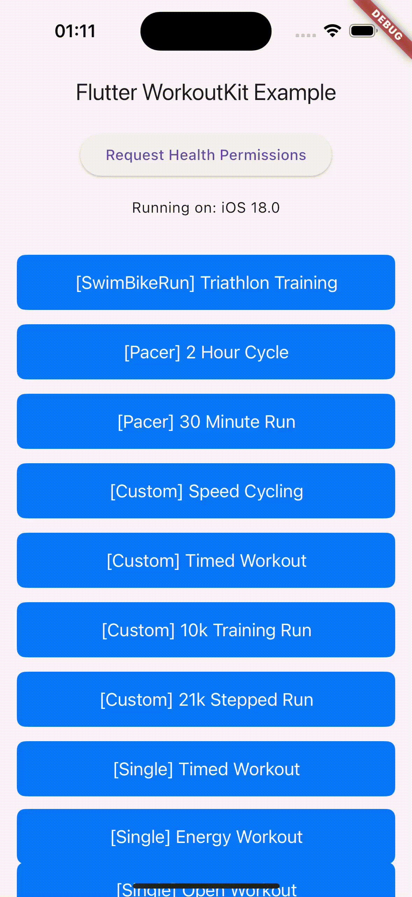
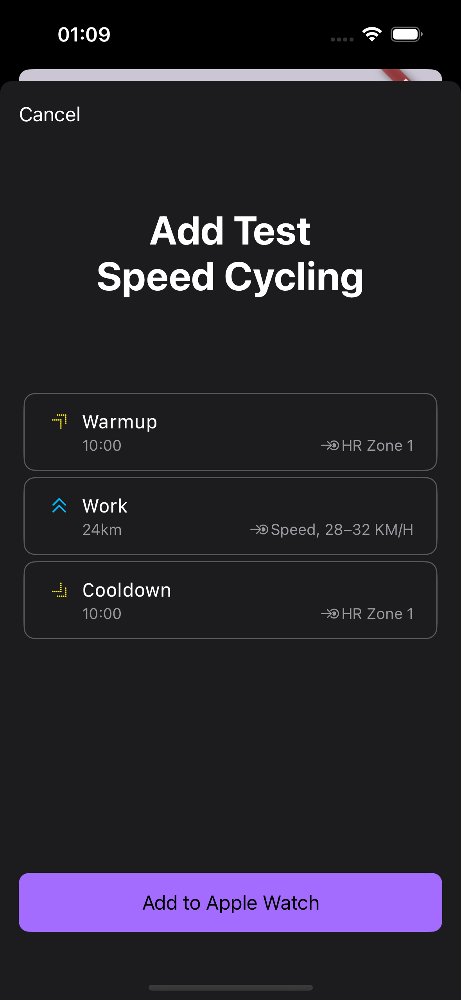
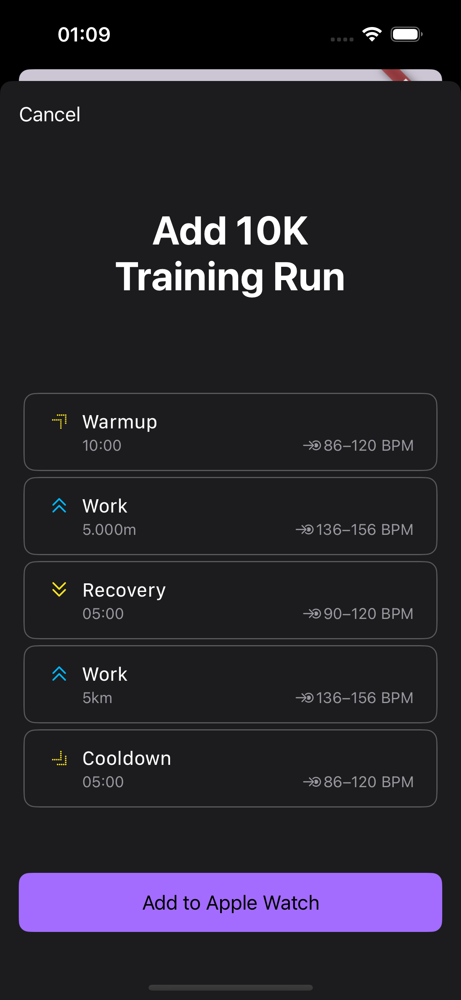
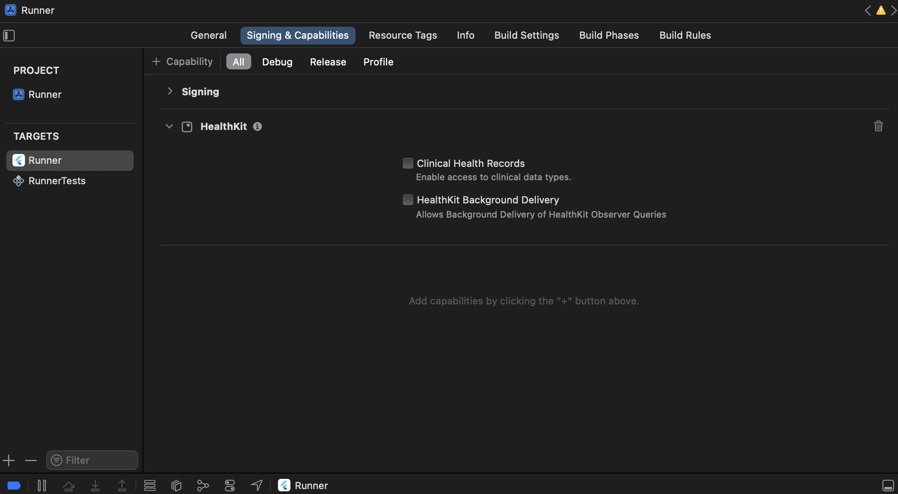

# flutter_workoutkit

> **Attention**: **This plugin is exclusively for iOS 17.0+ devices and requires an Apple Watch paired with the iOS device. Android devices are not supported.**

A Flutter plugin that leverages Apple's [WorkoutKit SDK](https://developer.apple.com/documentation/workoutkit) to create, preview, and sync custom workouts with the Apple Watch Workout app. This plugin enables seamless integration between Flutter apps and WatchOS workout functionality, allowing developers to programmatically define and manage workout routines that users can access directly on their Apple Watch.

## 🔑 Key Features

- Create, preview, and sync custom workouts with the Apple Watch Workout app.
- Define custom, single goal, pacer or swim-bike-run workout routines with a variety of workout types using widgets.
- Set goals for each workout step, such as time, distance, or repetitions.
- Set variety of alerts, such as heart rate zones, pace, and power zones.
- Works seamlessly with the Workout app on Apple Watch.

## 🎥 Preview

<div style="display: flex; justify-content: space-between;">
    
</div>

## 📸 Screenshots

<div style="display: flex; justify-content: space-between;">
    
    
</div>

## 📝 Example Workout

```dart
final CustomWorkout speedCyclingWorkout = CustomWorkout(
  activityType: WorkoutActivityType.cycling,
  location: WorkoutLocationType.outdoor,
  displayName: "Speed Cycling",
  warmup: WorkoutStep(
    alert: HeartRateZoneAlert(zone: 1),
    goal: const WorkoutGoal(
      type: WorkoutGoalType.time,
      targetDuration: Duration(minutes: 10),
      unit: WorkoutGoalUnit.minutes,
    ),
  ),
  blocks: [
    IntervalBlock(
      type: IntervalBlockType.work,
      iterations: 1,
      steps: [
        IntervalStep(
          alert: SpeedRangeAlert(
            lowerBound: 28,
            upperBound: 32,
            unitSpeed: UnitSpeed.kilometersPerHour,
            metric: WorkoutAlertMetric.average,
          ),
          purpose: IntervalStepPurpose.work,
          goal: const WorkoutGoal(
            type: WorkoutGoalType.distance,
            targetValue: 24,
            unit: WorkoutGoalUnit.kilometers,
          ),
        ),
      ],
    ),
  ],
  cooldown: WorkoutStep(
    alert: HeartRateZoneAlert(zone: 1),
    goal: const WorkoutGoal(
      type: WorkoutGoalType.time,
      targetDuration: Duration(minutes: 10),
      unit: WorkoutGoalUnit.minutes,
    ),
  ),
);
```

## 📥 Installation

In your pubspec.yaml file within your Flutter Project add `flutter_workoutkit` under dependencies:

```yaml
dependencies:
  flutter_workoutkit: <latest_version>
```

This plugin requires HealthKit to be enabled in your project. Ensure you have the necessary permissions in your Info.plist file:

```xml
<key>NSHealthShareUsageDescription</key>
<string>Allow access to health data to track workouts.</string>
<key>NSHealthUpdateUsageDescription</key>
<string>Allow update of health data to track workouts.</string>
```

And ensure you have the necessary capabilities in your Xcode project:



## 📚 Usage

You can define a workout using one of the four Workout classes:

- `CustomWorkout`
- `PacerWorkout`
- `SwimBikeRunWorkout`
- `SingleGoalWorkout`

You can preview examples of each workout in the `lib/sampleWorkouts` folder in the plugin package or in the example app.

To preview and sync a workout, you can use the `WorkoutPreview` widget:

```dart
WorkoutPreview(workout: speedCyclingWorkout);
```

Before previewing a workout, you must request health permissions:

```dart
await workoutkitPlugin.requestHealthPermissions();
```

## 🎨 Customizing the preview button

TODO (in progress)

## 🚨 Active Development!

This plugin is currently under active development. Breaking changes may be introduced until version 1.0.0 is released. Please report any issues or feature requests on the [GitHub repository](https://github.com/mhoc/flutter_workoutkit).

## 🚧 Roadmap

- ✅ Add support for `WorkoutPreview` for previewing workouts
- ❌ Add customization options for `WorkoutPreview` widget
- ❌ Add support for `WorkoutScheduler` for scheduling and managing workouts
- ❌ Add support for `ScheduledWorkoutPlan` for scheduling workout plans
- ❌ Add support for `poolSwimDistanceWithTime` for workout goals.
- ❌ Add graceful degradation for older iOS versions.
- ❌ Improve examples and example app
- ❌ Improve documentation
- ❌ Add tests
- ❌ (Long term) Explore options for supporting Android

## 📝 License

This project is licensed under the Apache License 2.0. See the [LICENSE](LICENSE) file for details.

## 📧 Contact

For questions or feedback, please contact me at a@adamkramer.dev

## 💰 Buy me a coffee

If you find this plugin useful, please consider buying me a coffee:

<a href="https://buymeacoffee.com/admkrmr"></a>
